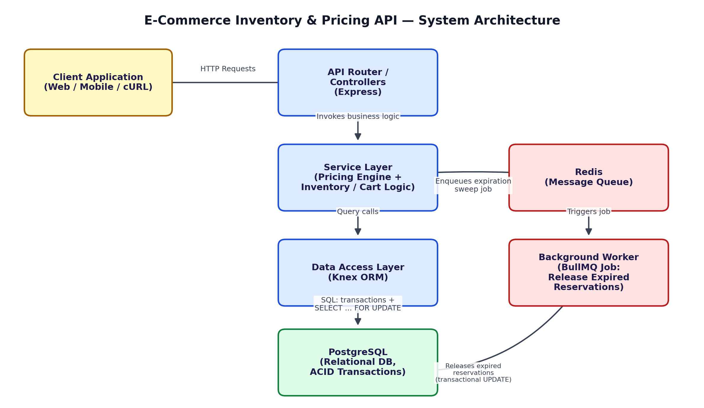
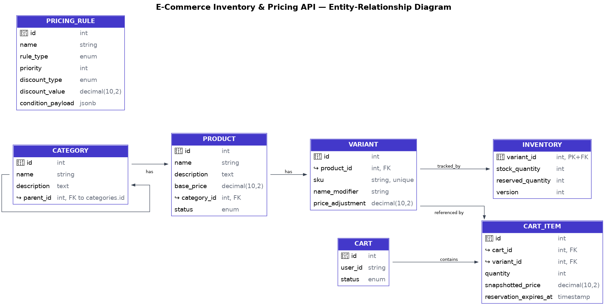

# E-Commerce Inventory & Dynamic Pricing API

A REST API for an e-commerce platform covering hierarchical catalog
management, a rules-based dynamic pricing engine, and race-condition-safe
inventory reservation with cart-expiration handled by a decoupled
background worker.

Stack: **Node.js / Express**, **PostgreSQL** (via Knex), **Redis + BullMQ**
(reservation-expiration queue), **Docker Compose**.




## Quick start

```bash
cp .env.example .env
docker-compose up --build
```

This boots four containers: `api` (port 8080), `worker`, `db` (Postgres 15,
port 5432), and `redis`. The `api` and `worker` containers each run
`knex migrate:latest` on startup before starting their process, so the
schema is created automatically — no manual migration step required.

Seed demo data (optional, run from your host once the stack is up):
```bash
docker-compose exec api npx knex seed:run
```

Smoke test:
```bash
curl http://localhost:8080/health
curl http://localhost:8080/products
```

### Running tests
Tests run against a real Postgres instance (they exercise actual
transactions and row locks — mocking the DB would defeat the point of
testing concurrency).
```bash
docker-compose up -d db redis
cp .env.example .env   # DATABASE_URL should point at localhost:5432 if running npm test on the host
npm install
npm run migrate
npm test
```
`tests/concurrency.test.js` fires concurrent `POST /cart/items` requests at
constrained stock and asserts the final `reserved_quantity` never exceeds
`stock_quantity` — i.e., no overselling.

### Running without Docker
```bash
npm install
# point DATABASE_URL / REDIS_URL in .env at your own Postgres/Redis
npm run migrate
npm start        # API on :8080
npm run worker   # in a second terminal
```

## Project layout

```
src/
├── controllers/   # HTTP layer: parse req, call a service, shape the response
├── services/      # business logic: pricing engine, inventory locking, checkout
├── routes/        # Express route -> controller wiring
├── workers/        # BullMQ queue setup + the expiration-sweep job itself
├── utils/         # money (cents) helpers, typed API errors
├── app.js         # Express app factory (used by both the server and tests)
├── index.js       # API process entry point
└── worker.js      # background worker process entry point
migrations/        # Knex schema migrations (run automatically on boot)
seeds/             # optional demo data
tests/             # Jest + Supertest, including the concurrency test
docs/API.md        # full endpoint reference
```

## Architectural choices

**Layered architecture.** Controllers only parse/validate HTTP input and
shape responses; all business rules (pricing math, locking, checkout
sequencing) live in `services/`, which know nothing about Express. This
keeps the concurrency-critical code testable in isolation (see
`tests/worker.test.js`, which calls `releaseExpiredReservations()`
directly with no HTTP layer involved) and means a future GraphQL or gRPC
front end could reuse the same services unchanged.

**Currency as `NUMERIC(10,2)` in Postgres, integer cents in application
math.** The `pg` driver returns `NUMERIC` columns as strings (not JS
floats) specifically to avoid silent precision loss, and `src/utils/money.js`
converts those strings to integer cents before any arithmetic, then back to
a decimal string for the response. This sidesteps `0.1 + 0.2 = 0.30000000000000004`-class
bugs entirely — nothing money-related is ever a JS `float` mid-calculation.

### Concurrency control

The core risk is **overselling**: two shoppers racing for the last unit of
a variant, both reading `available = 1`, both proceeding to reserve it.

This system uses **pessimistic locking** (`SELECT ... FOR UPDATE`) rather
than optimistic locking, because inventory reservation is a
read-then-conditionally-write operation under contention we expect to be
common (flash sales, limited-drop SKUs) — optimistic locking would mean
retrying failed writes in a loop under exactly the load pattern we're
trying to protect against, whereas a row lock makes the second transaction
simply wait its turn and see fresh data. A `version` column is *also*
present on `inventory` as a secondary safety net / audit trail, in case a
future code path bypasses the transaction helper.

Every inventory-mutating operation follows this shape (see
`src/services/cartService.js`):
```
BEGIN;
  SELECT stock_quantity, reserved_quantity FROM inventory WHERE variant_id = ? FOR UPDATE;
  -- available = stock_quantity - reserved_quantity
  -- if quantity > available: ROLLBACK, return 409
  UPDATE inventory SET reserved_quantity = reserved_quantity + ? WHERE variant_id = ?;
  INSERT/UPDATE cart_items ... snapshotted_price, reservation_expires_at;
COMMIT;
```
`FOR UPDATE` takes an exclusive row lock for the duration of the
transaction, so a second concurrent request touching the same
`variant_id` blocks at its own `SELECT ... FOR UPDATE` until the first
transaction commits or rolls back — it can never act on a stale read.
Checkout (`cartService.checkout`) uses the same pattern to permanently
deduct `stock_quantity`.

The background expiration sweep (`src/workers/expirationWorker.js`) uses
`SELECT ... FOR UPDATE SKIP LOCKED` when it grabs expired `cart_items`, so
overlapping sweep runs never double-process the same row, and it locks
inventory rows in ascending `variant_id` order to avoid deadlocking against
the cart-addition transaction. The entire sweep (row selection, inventory
decrement, `cart_items` deletion) is one transaction, so a crash mid-sweep
rolls back cleanly and a rerun re-discovers the same still-expired rows —
**idempotent by construction**, not by a separate "already processed" flag.

`tests/concurrency.test.js` verifies this directly: it fires 10 concurrent
`POST /cart/items` requests against a variant with 3 units of stock and
asserts exactly 3 succeed, 7 get `409`, and `reserved_quantity` never
exceeds `stock_quantity`.

### Dynamic pricing engine

`src/services/pricingService.js` implements a **pipeline / strategy
pattern**: `calculatePrice()` starts from `base_price + variant.price_adjustment`,
then loads all active `pricing_rules` ordered by `priority` ascending, and
for each rule delegates to a strategy function keyed by `rule_type`
(`USER_TIER`, `BULK`, `PROMO_CODE`, `SEASONAL`) that decides — using the
rule's `condition_payload` JSON and the request context (quantity, tier,
promo code) — whether it applies and how much to subtract. Each applied
rule appends a `{ rule_name, discount_type, discount_amount }` entry to the
response's `applied_discounts` breakdown, and the running price is clamped
to never go below zero.

**Default rule hierarchy** (via `priority`, lower runs first): `USER_TIER`
(10) → `BULK` (20) → `PROMO_CODE` (30/`SEASONAL`). This order is a
business decision, not a hardcoded constant — an admin creates rules via
`POST /pricing-rules` with whatever `priority` they want, so the hierarchy
is fully data-driven. The rationale for the *default* ordering: tier
discounts reflect a customer relationship and should be guaranteed
regardless of what else is going on; bulk discounts reward basket size on
top of that; promo codes (marketing-driven, often stackable, often
fixed-amount) apply last so they're computed against the "real" discounted
price rather than list price, avoiding cases where a promo code and a tier
discount compound in a way that makes the item free.

**Price snapshotting.** `snapshotted_price` on `cart_items` is written once
at add-to-cart time (after running the full pricing pipeline) and is never
recomputed. `GET /cart/:id` always returns this stored value — changing a
product's `base_price` or a pricing rule after the fact has zero effect on
items already in a cart, which is the point: a shopper's expected total
shouldn't shift under them between "add to cart" and "checkout".

### Background worker

Reservations expire `RESERVATION_TTL_MINUTES` (default 15) after being
added to a cart. Rather than checking expiration synchronously on every
request (which would mean paying that cost on the hot path, and would
still leave inventory "reserved" for abandoned carts between requests), a
separate `worker` process (own container in `docker-compose.yml`) runs a
BullMQ **repeatable job** every `EXPIRATION_SWEEP_INTERVAL_SECONDS`
(default 60s) that bulk-releases everything expired so far in a single
SQL pass — see the Concurrency section above for the locking details.
Redis/BullMQ was chosen over a bare `setInterval` so the job is durable
across worker restarts and horizontally scalable if the worker is ever run
with multiple replicas.

## Environment variables

See `.env.example`. Key ones: `DATABASE_URL`, `REDIS_URL`,
`RESERVATION_TTL_MINUTES`, `EXPIRATION_SWEEP_INTERVAL_SECONDS`.

## API documentation

Full endpoint reference: [`docs/API.md`](docs/API.md).

## Known simplifications

- No authentication layer — `user_id` / `user_tier` are passed directly by
  the client, as the task is scoped to inventory/pricing/concurrency, not
  auth. A production system would derive these from a verified session.
- A cart is identified by numeric `id` rather than tied to a logged-in
  user session; `POST /cart/items` will create one implicitly if `cart_id`
  is omitted.
